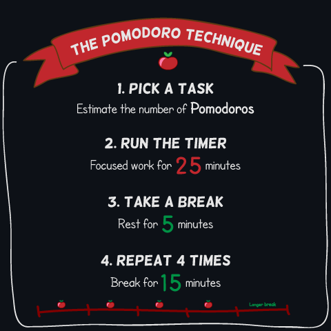
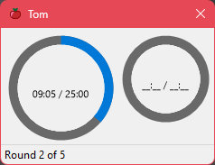
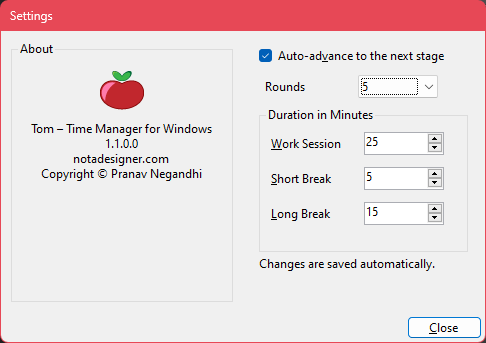

# Tom - Time Manager for Windows

Tom is a time manager for Windows based on the Pomodoro Technique by Francesco Cirillo.

## The Technique

The graphic below illustrates the steps that have to be executed for this technique.

## The Application

Tom is a minimal implementation of this technique. You get 4 timers, each of which runs for 25 minutes. The buzzer goes off when this time is up, and a 5 minute break timer starts off by itself. The application switches to active work mode after the break is over.

The application runs a longer break of 15 minutes after the last active work period is completed.

The application icon appears in the Notification Tray area at the bottom right. Right-click on it to expose the application context menu, which has commands to start the timer and open the settings window.

The duration of the work session, short break and long break can be configured from the Settings dialog box.

