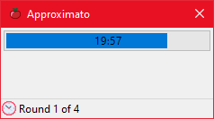
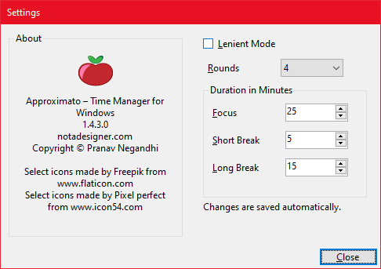

# Approximato

🕓 Use your time wisely

* Increase time awareness
* Track hours spent on a task
* Improve estimation heuristics
* Identify productive periods
* 100% offline operation

Approximato uses the Pomodoro technique 🍅 to track time, allowing some leniency to take unscheduled breaks or extending working periods if needed (like when you're within touching distance of completing a task). Overtime is tracked separately from the focus period, and can be useful in estimating future tasks, or in identifying periods of high-productivity periods during the day.

The application user interface is made up of 2 countdown timers and a context menu. The larger timer is used to display the time elapsed during a focus period, while the smaller one is used to indicate time elapsed during a break.

To begin a new Pomodoro, right click on the application icon in the Notification tray and click on Start. The application is pre-programmed with 4 focus sessions of 25 minutes, each followed by a 5 minute break. The last break is 15 minutes long by default. When a focus session is completed, the application transitions into a break. An alarm bell is rung and a notification message is shown to indicate this state change. When the break completes, the application transitions back into a new focus period. The alarm bell is rung twice along with a notification message. After the fourth focus period, the application is transitioned into a longer break. This is similar to how the standard Pomodoro technique is usually implemented.

Approximato adds some flexibility to this process.

* Focus periods can be interrupted. ⚠️
* Interruptions are tracked. 🔍
* Focus periods can be resumed after an interruption. Resuming resets the clock for that focus period. ⏰
* The transition between focus and breaks can be automatic or manual. ⚙️
* Use Lenient mode for inifinite focus periods when you're in the zone. 🤫
* A Pomodoro can be abandoned entirely. ❌

# Screenshots

